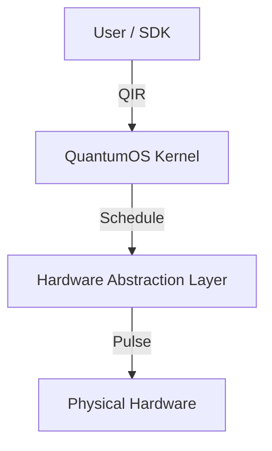

# QuantumOS (QOS) - Next-Generation Quantum Operating System

## 1. Introduction
QuantumOS (QOS) is a pioneering quantum operating system built on microkernel architecture and a Hardware Abstraction Layer (HAL). It addresses the critical challenges in the current quantum computing ecosystem: tight coupling between software and hardware, and inefficient resource scheduling. By introducing the standardized **QOS-DP (Quantum OS Driver Protocol)**, QOS achieves complete decoupling of quantum algorithms from heterogeneous hardware backends (Superconducting, Ion Trap, Neutral Atom) while enabling millisecond-level real-time pulse control.

## 2. Why QuantumOS Matters?
### 🚀 Solving the "Vertical Silo" Problem
Current quantum software stacks (e.g., Qiskit for IBM, IonQ for Trapped Ions) are vertically integrated, locking users into specific hardware vendors. QOS breaks these silos by providing a unified HAL, allowing the same algorithm code (e.g., VQE) to run seamlessly across different physical platforms without modification.

### ⚡ Real-Time Hybrid Scheduling
Traditional batch-processing systems leave expensive QPUs idle while waiting for classical computation. QOS introduces a **Multi-Level Feedback Queue (MLFQ)** scheduler that supports preemption and time-slicing. This enables efficient execution of hybrid quantum-classical algorithms (like VQE/QAOA) and real-time Quantum Error Correction (QEC) routines.

### 🎛️ Pulse-Level Control
Unlike high-level gate abstractions that hide physical details, QOS exposes a compilation path from logical gates to microwave/laser pulses. It supports advanced techniques like **Cross-Resonance (CR)** and **Echo Pulses**, significantly improving the fidelity of entanglement gates (CNOT/CZ).

## 3. Project Structure
```bash
QuantumOS/
├── dashboard/                  # Web-based visualization dashboard
│   ├── app.py                  # FastAPI backend server
│   ├── index.html              # Frontend interface
│   └── static/                 # Static assets (generated images)
├── kernel_rust/                # Core Microkernel (Rust)
│   ├── src/
│   │   ├── main.rs             # Kernel entry point
│   │   ├── scheduler.rs        # MLFQ Scheduler implementation
│   │   └── qubit.rs            # Qubit resource management
│   └── Cargo.toml              # Rust dependencies
├── drivers/                    # Hardware Drivers (Plugins)
│   ├── superconducting.rs      # Transmon driver (CR pulses)
│   ├── ion_trap.rs             # Ion Trap driver (MS gates)
│   └── neutral_atom.rs         # Neutral Atom driver (Rydberg blockade)
├── patents/                    # Technical Disclosures & IP
│   ├── patent_1_technical_disclosure.md  # Architecture Patent
│   └── patent_2_qisa_compiler.md         # Compiler Patent
├── generate_vqe_workflow.py    # VQE Workflow Visualization Script
├── generate_alternatives.py    # Heterogeneous Backend Comparison Script
├── requirements.txt            # Python dependencies
└── README.md                   # Project Documentation
```

## 4. System Architecture
```
+-------------------------------------------------------+
|                 Application Layer (SDK)               |
|   (VQE, QAOA, Shor, QEC Codes) - Python/C++ Bindings  |
+---------------------------+---------------------------+
                            | QIR / OpenQASM 3.0
+---------------------------v---------------------------+
|                   QuantumOS Kernel                    |
|   [Scheduler (MLFQ)]   [Resource Manager]   [Security]|
+---------------------------+---------------------------+
                            | QOS-DP Interface (Rust)
+---------------------------v---------------------------+
|              Hardware Abstraction Layer (HAL)         |
|   [Compiler (Gate->Pulse)]   [Topology Mapper]        |
+---------------------------+---------------------------+
                            | Microwave/Laser Pulses
+---------------------------v---------------------------+
|                   Physical Hardware                   |
|   [Superconducting]   [Ion Trap]   [Neutral Atom]     |
+-------------------------------------------------------+
```
The system follows a strict 4-layer design:
1.  **Application Layer**: Python SDK for defining quantum circuits (Ansatz).
2.  **Kernel Layer**: Rust-based microkernel for task scheduling and resource management.
3.  **HAL Layer**: Hardware Abstraction Layer for topology mapping and pulse compilation.
4.  **Hardware Layer**: Physical execution on heterogeneous QPUs or Simulators.



## 5. Getting Started

### 5.1 Prerequisites
*   **Python**: 3.9+
*   **Rust**: 1.70+
*   **Dependencies**: `numpy`, `matplotlib`, `fastapi`, `uvicorn`

### 5.2 Installation
1.  **Clone the repository**
    ```bash
    git clone https://github.com/crystal-tensor/QuantumOS.git
    cd QuantumOS
    ```

2.  **Build the Kernel**
    ```bash
    cd kernel_rust
    cargo build --release
    cd ..
    ```

3.  **Install Python requirements**
    ```bash
    pip install -r requirements.txt
    ```

### 5.3 Running the System
1.  **Start the Backend Server**
    ```bash
    python3 dashboard/app.py
    ```
    The server will start at `http://localhost:8000`.

2.  **Access the Dashboard**
    Open `http://localhost:8000` in your browser to visualize the workflow:
    *   **Start Rust Kernel**: Initialize the scheduler.
    *   **Run SDK Example**: Submit a VQE task and watch the real-time execution flow.

## 6. Demonstration
*   **VQE Workflow**: Run `python3 generate_vqe_workflow.py` to see the end-to-end execution of a 4-qubit H2 molecule simulation, including Ansatz circuit, topology mapping, and pulse sequences.
*   **Heterogeneous Support**: Run `python3 generate_alternatives.py` to visualize how the same algorithm maps to Neutral Atom and Ion Trap architectures.

## 7. License
MIT License
